# Lab 1 - Peer Review Record

**Author:** Suwiwat Sinsomboon - 67070503444 - GitHub: [@iceswift](https://github.com/iceswift)
**Peer reviewer:** Peemmapat Sripongsai - 67070503436 - GitHub: [@SupeemAFK](https://github.com/SupeemAFK)

## Pull Requests I authored

All feature PRs targeted `lab1-staging` and received formal approval from the peer reviewer before merge.

| PR | Feature branch | Result |
|----|----------------|--------|
| [#5](https://github.com/iceswift/toktickit/pull/5) | `feature/1-project-foundation` | Approved by @SupeemAFK |
| [#6](https://github.com/iceswift/toktickit/pull/6) | `feature/2-health-check` | Approved by @SupeemAFK |
| [#7](https://github.com/iceswift/toktickit/pull/7) | `feature/3-category-seed` | Approved by @SupeemAFK |
| [#8](https://github.com/iceswift/toktickit/pull/8) | `feature/4-category-list` | Approved by @SupeemAFK |

### PR #5 - Project foundation

**Reviewer comment:** SupeemAFK reported that the frontend/backend builds, Vite and Express responses, PostgreSQL/Prisma checks, and ignored files were valid, concluding with "Good works LGTM."

**My response:** I thanked the reviewer, recorded the evidence, and waited for formal approval before merging.

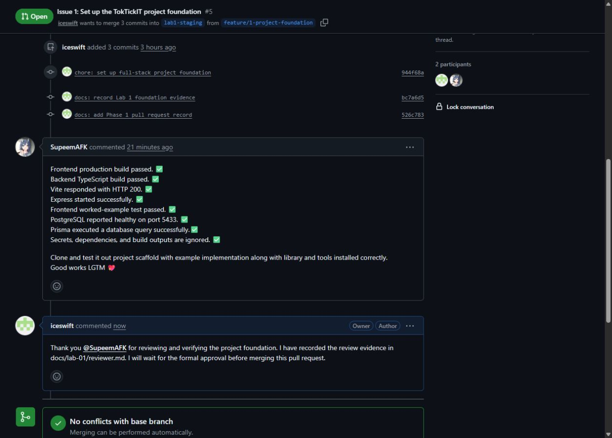

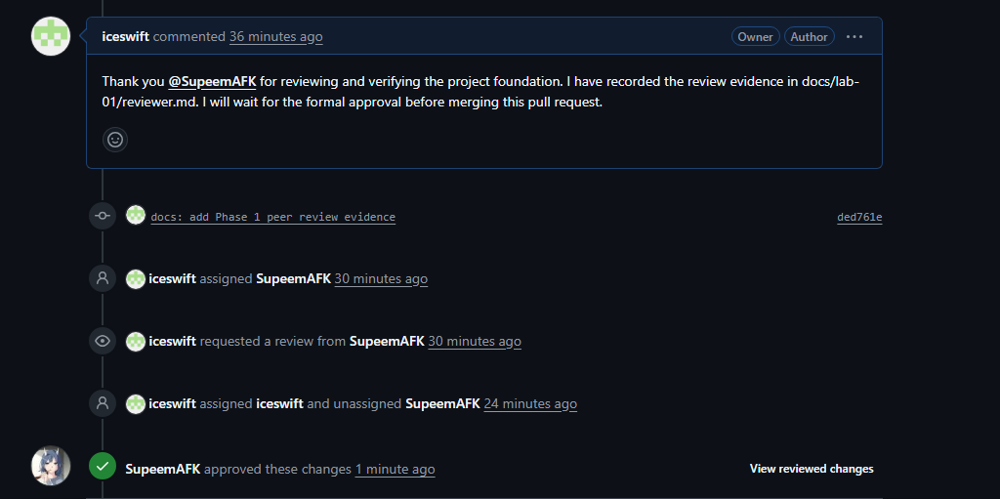

### PR #6 - API health check

**Reviewer comment:** SupeemAFK confirmed that the client and server health-check implementation was correct and the tests passed, concluding with "LGTM."

**My response:** I thanked the reviewer for verifying the implementation and test results and recorded the evidence.

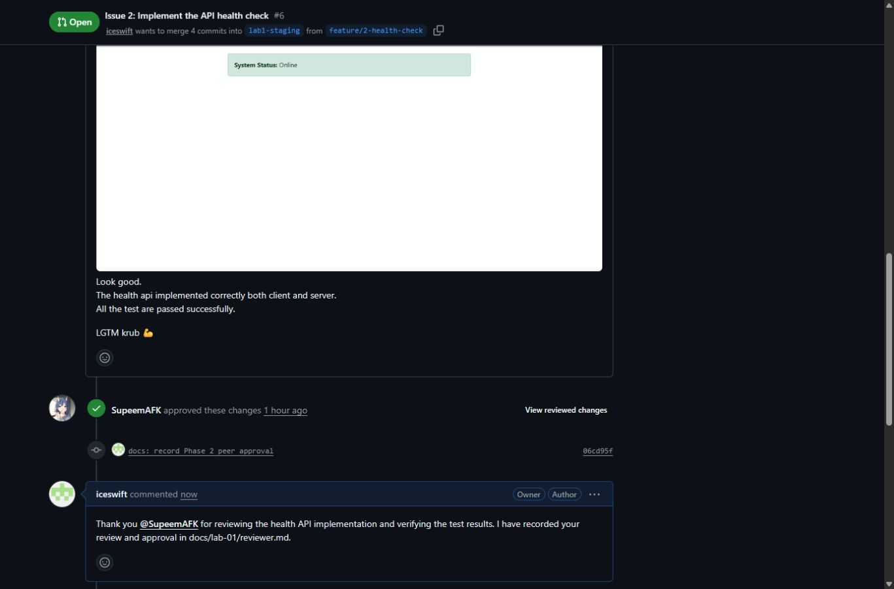

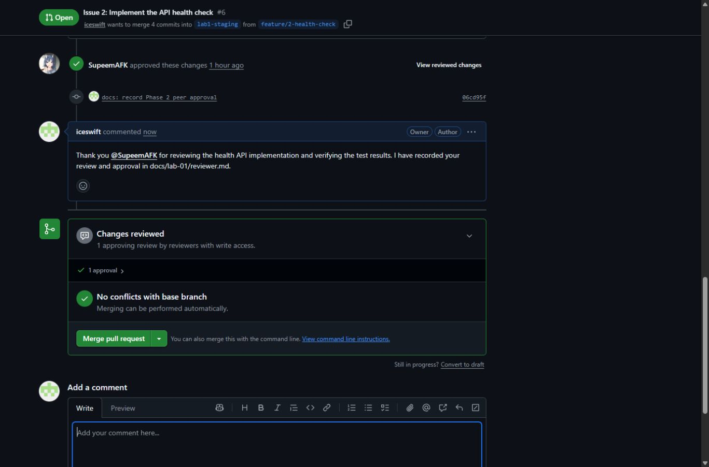

### PR #7 - Category model and seed

**Reviewer comment:** SupeemAFK asked which command was used to seed the categories.

**My response:** I explained that I ran `npm run prisma:seed` from `server` twice and verified that the database still contained four rows with four distinct names. SupeemAFK then confirmed the schema/seed, concluded with "LGTM," and approved the PR.

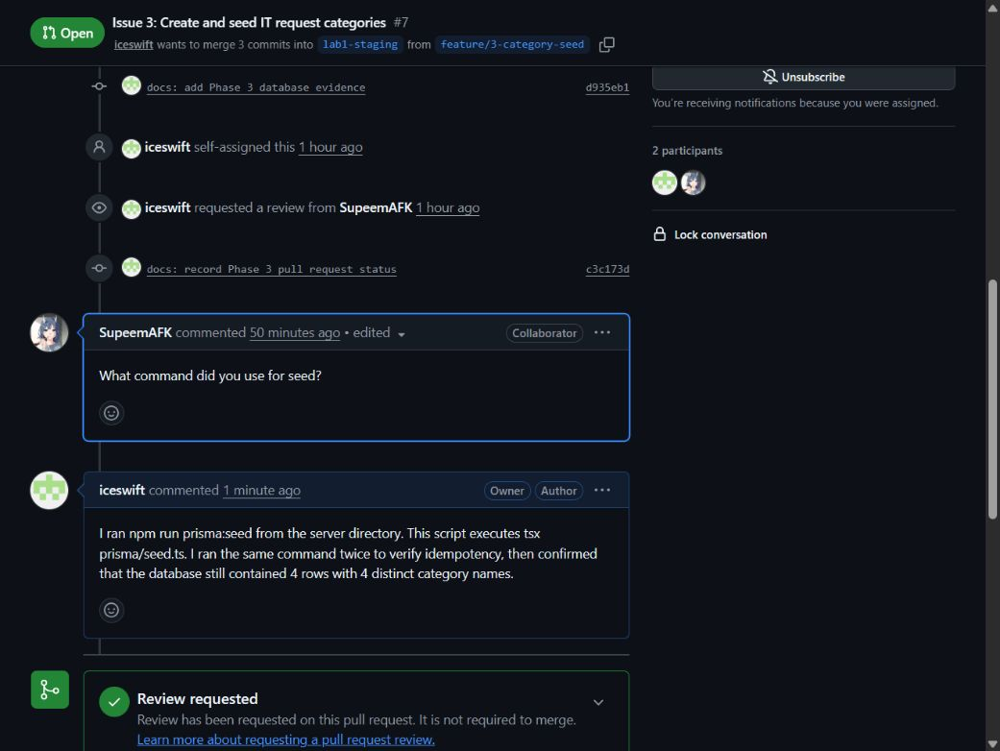

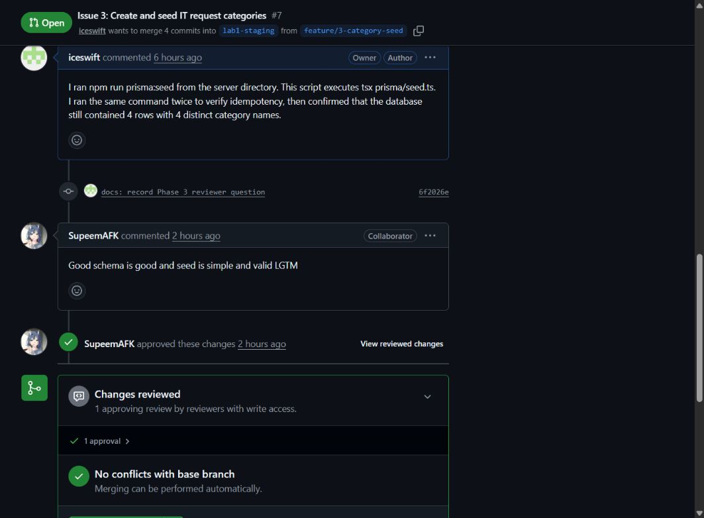

### PR #8 - Display category list

**Reviewer comment:** SupeemAFK reviewed the code, tests, and working-application image, reported that the tests passed, and concluded with "LGTM."

**My response:** I thanked the reviewer for checking the implementation and evidence and recorded the formal approval.

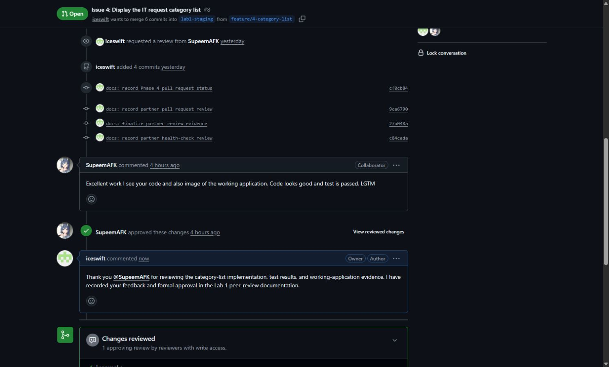

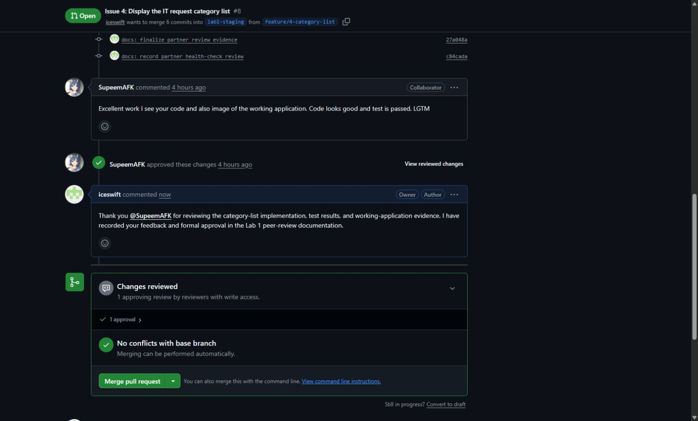

## Pull Requests I reviewed for a partner

| PR | Feature | Review result |
|----|---------|---------------|
| [MeldyRose #6](https://github.com/MeldyRose/TokTickIT-Individual-Sprints/pull/6) | Project foundation | Approved after revisions |
| [MeldyRose #7](https://github.com/MeldyRose/TokTickIT-Individual-Sprints/pull/7) | API health check | Approved after one revision |

### MeldyRose PR #6 - Project foundation

**My review:** I cloned `feature/1-project-foundation`, ran its checks, and requested a tracked `server/.env.example` plus complete README setup instructions. My first review also treated the future health test too strictly; after rereading the Issue boundaries, I corrected that point because implementation of `GET /api/health` belonged to Issue 2.

**Partner response:** MeldyRose added the environment template, expanded the README, replied on the same PR, and requested another review.

**Final result:** I checked the new commits and formally approved the Issue 1 PR as a collaborator with write access.

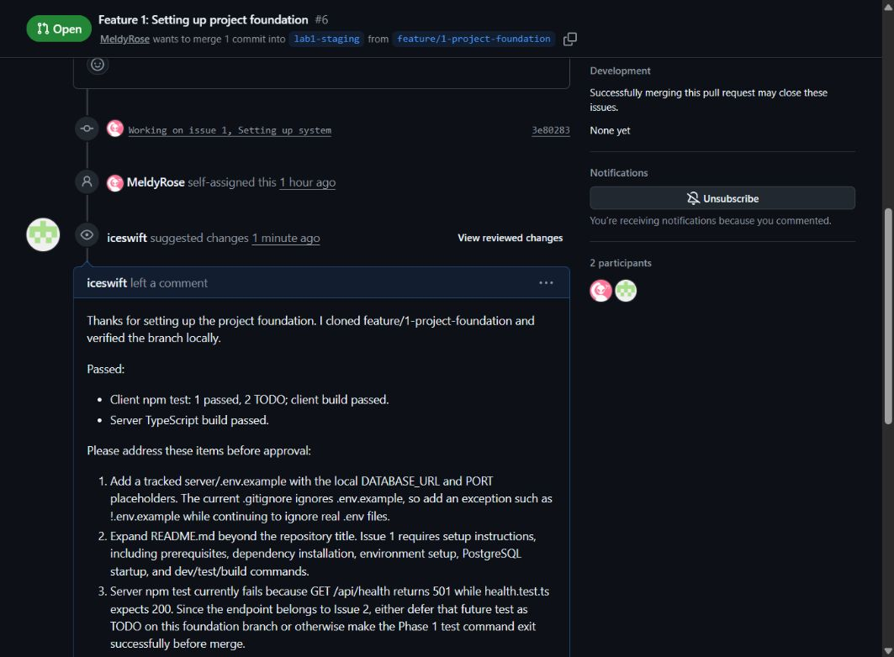

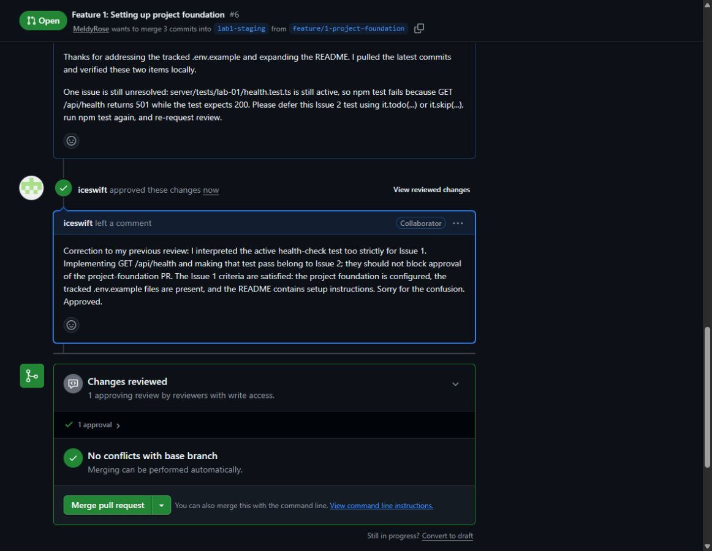

### MeldyRose PR #7 - API health check

**My review:** I fetched `feature/2-health-check` and tested both applications. The client called the real health API and handled Online/Offline states, but the server endpoint still returned HTTP 501, so its Supertest failed. I requested the required Issue 2 backend implementation.

**Partner response:** MeldyRose pushed commit `43b5272`, implementing `GET /api/health` with HTTP 200 and the required JSON response.

**Final result:** I fetched the new commit and reran the tests/builds. The health Supertest and client test passed, both builds succeeded, and I formally approved the PR.

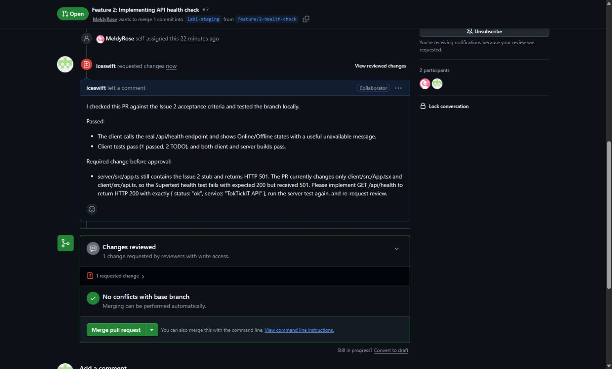

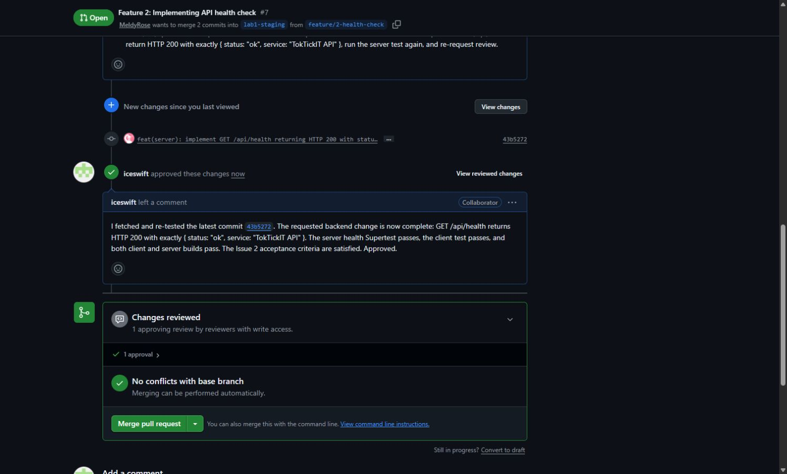
