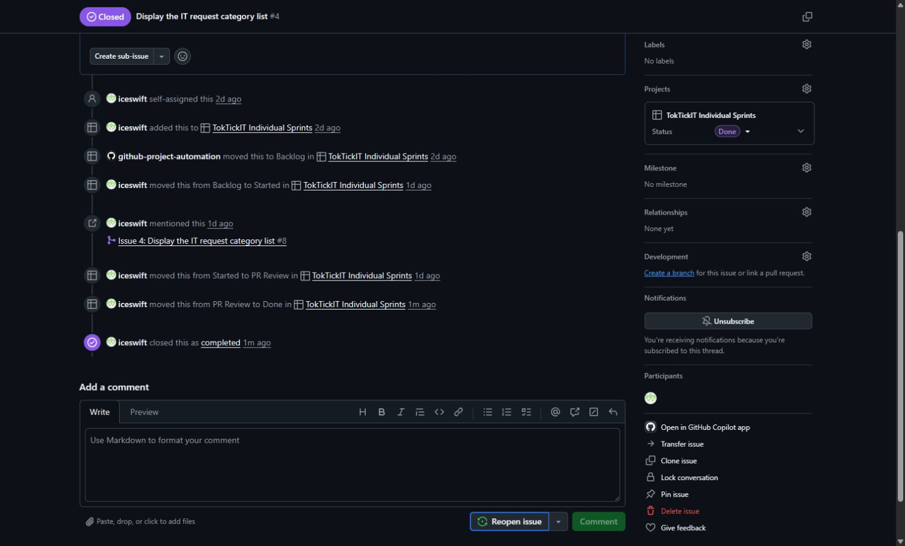

# Lab 1 - Test Plan and Evidence

All automated tests are stored in the required `tests/lab-01/` folders:

- Server: `server/tests/lab-01/`
- Client: `client/tests/lab-01/`

## Required test catalogue

| Test ID | File | Tool | Test description | Final result |
|---------|------|------|------------------|--------------|
| API-01 | `server/tests/lab-01/health.test.ts` | Supertest + Vitest | `GET /api/health` returns HTTP 200 and `{ status: "ok", service: "TokTickIT API" }` | Passed |
| API-02 | `server/tests/lab-01/categories.test.ts` | Supertest + Vitest | `GET /api/categories` returns the four seeded categories in ascending ID order | Passed |
| UI-01 | `client/tests/lab-01/App.test.tsx` | Vitest + Testing Library | TokTickIT heading renders | Passed |
| UI-02 | `client/tests/lab-01/App.test.tsx` | Vitest + Testing Library | Loading state is shown while pending; success then shows Online and four API-provided categories | Passed (2 cases) |
| UI-03 | `client/tests/lab-01/App.test.tsx` | Vitest + Testing Library | API failure displays Offline and a useful error message | Passed |

## Final integrated verification

Verified on 12 August 2026 on `feature/Lab1Doc`, which is based on the completed `lab1-staging` code after PR #8 was merged.

### Environment preparation

```text
docker compose up -d postgres
cd server
npm run prisma:seed
```

The seed completed successfully with: `Seeded 4 IT request categories.`

### Commands and results

| Location | Command | Result |
|----------|---------|--------|
| `server/` | `npm test -- --run` | Passed: 2 test files, 2 tests |
| `client/` | `npm test -- --run` | Passed: 1 test file, 4 tests |
| `server/` | `npm run build` | Passed: TypeScript build |
| `client/` | `npm run build` | Passed: TypeScript and Vite production build |

For the submission report, these same commands will be rerun on the final `main` branch and their passing terminal output will be shown in Answer Part 2.

## Functional evidence

### Health API and frontend status

The frontend uses the real `GET /api/health` response to display the system as Online.


### PostgreSQL category seed

The seed is idempotent and leaves exactly four distinct request categories: Account and Access, Hardware, Software, and Network.


### Category API and UI states

`GET /api/categories` reads from PostgreSQL through Prisma, returns predictable ID order, and the React page displays loading, success, and failure states.


### Workflow completion

PR #8 received formal approval and was merged into `lab1-staging`. Issue #4 was moved from PR Review to Done and closed as completed.


