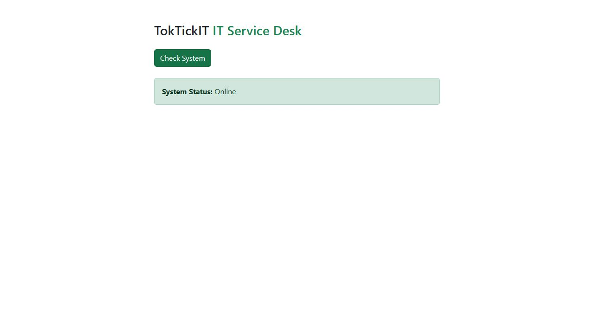
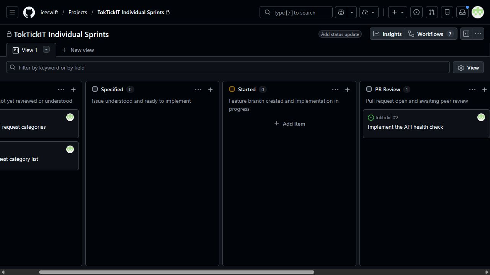
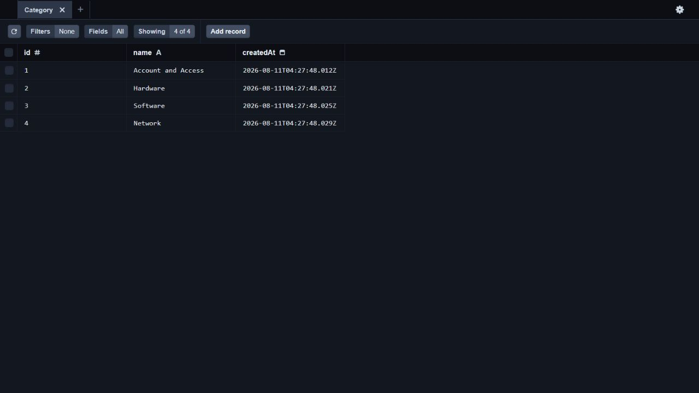
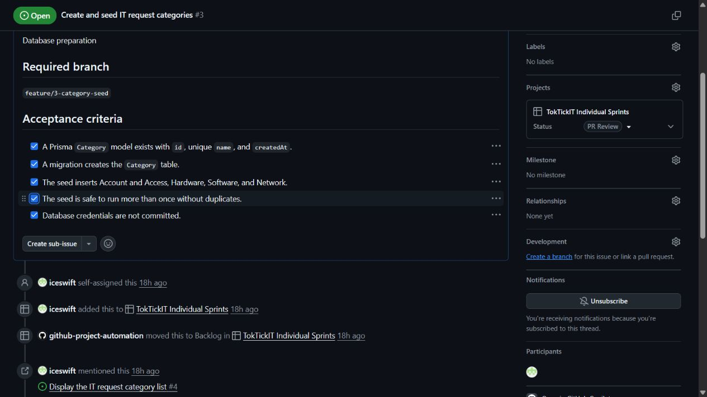
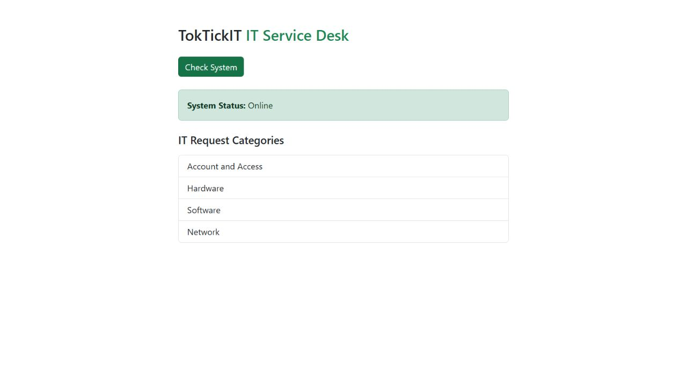
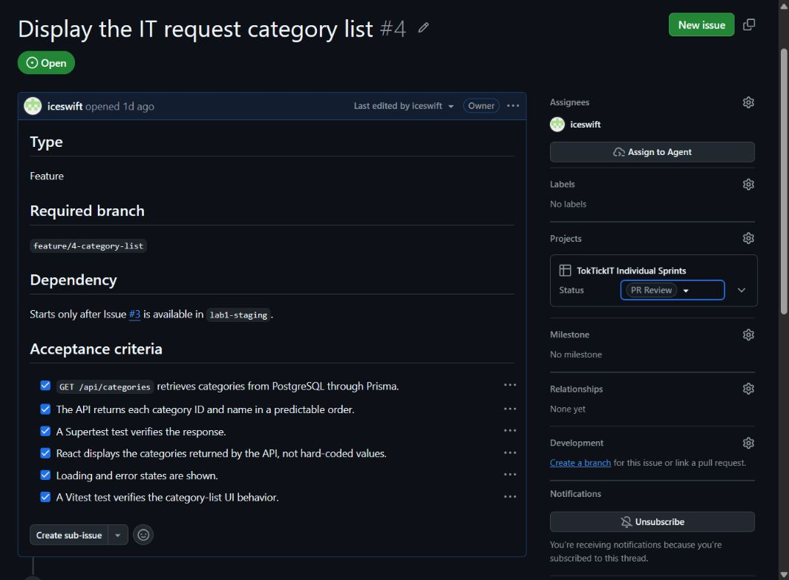

# Lab 1 — Test Plan and Evidence

All test files live under server/tests/lab-01/ and client/tests/lab-01/.

| # | Tool | Test | Result |
|---|------|------|--------|
| 1 | Supertest | GET /api/health returns 200, status=ok | Passed in Phase 2 |
| 2 | Supertest | GET /api/categories returns 4 seeded categories in id order | Passed in Phase 4 |
| 3 | Vitest | Heading renders | Passed in Phase 2 |
| 4 | Vitest | Success state shows Online + category list | Passed in Phase 4 |
| 5 | Vitest | Error state shows Offline + message | Passed in Phases 2 and 4 |

## Phase 1 foundation verification

Verified on 10 August 2026 before the Issue 1 commit:

| Check | Result |
|-------|--------|
| Frontend production build (`npm run build`) | Passed |
| Backend TypeScript build (`npm run build`) | Passed |
| Frontend worked-example test | 1 passed, 2 future Issue 4 tests remain TODO |
| Vite development server | HTTP 200 at `http://localhost:5173` |
| Express server foundation | Started on port 3000; the health route remains the expected Issue 2 stub |
| PostgreSQL container | Healthy on local port 5433 |
| Prisma-to-PostgreSQL connection | `SELECT 1` executed successfully |

## Phase 2 health-check verification

Verified on 10 August 2026 on `feature/2-health-check`:

| Command | Result |
|---------|--------|
| Server `npm test` | Passed: health Supertest file, 1 test |
| Client `npm test` | Passed: 1 Vitest file, 3 tests; 2 future Issue 4 tests remain TODO |
| Server `npm run build` | Passed |
| Client `npm run build` | Passed |
| Live `GET /api/health` | HTTP 200 with `status=ok` and `service=TokTickIT API` |
| Live React check | Displayed `System Status: Online` from the API call |

Issue 2 moved through **PR Review** and was closed as **Done** after PR #6 received formal approval and was merged into `lab1-staging`.

## Phase 3 category database verification

Verified on 11 August 2026 on `feature/3-category-seed`:

| Check | Result |
|-------|--------|
| Prisma migration | Created the `Category` table with `id`, unique `name`, and `createdAt` |
| First seed run | Inserted Account and Access, Hardware, Software, and Network |
| Second seed run | Completed successfully without creating duplicate rows |
| Database query | 4 rows and 4 distinct names |
| Server `npm test` | Passed: 1 test; 1 future Issue 4 test remains TODO |
| Client `npm test` | Passed: 3 tests; 2 future Issue 4 tests remain TODO |
| Server and client builds | Passed |
| Credentials check | Local `server/.env` remains ignored; only `.env.example` is tracked |

Prisma Studio confirms that the database contains exactly the four required categories after the seed was run twice.

All Issue 3 acceptance criteria were checked after verification. The issue was then moved to **PR Review** when PR #7 was opened and the peer review was requested.

## Phase 4 category-list verification

Verified on 11 August 2026 on `feature/4-category-list`:

| Check | Result |
|-------|--------|
| Live `GET /api/categories` | HTTP 200 with the four seeded categories in ID order |
| Prisma query | Reads `id` and `name` from PostgreSQL and orders by ascending `id` |
| Server `npm test` | Passed: 2 Supertest files, 2 tests |
| Client `npm test` | Passed: 1 Vitest file, 4 tests |
| Loading UI | Displays a loading status while the request is pending |
| Success UI | Displays Online and all four API-provided categories |
| Error UI | Displays a useful Offline message when the request fails |
| Server and client builds | Passed |

The live React application displayed the category list returned by the Express and Prisma API.

All Issue 4 acceptance criteria were checked after verification. The issue was then moved to **PR Review** when PR #8 was opened and the peer review was requested.

The final Lab 1 test evidence will replace or supplement this setup evidence
after all required features are implemented on `main`.
