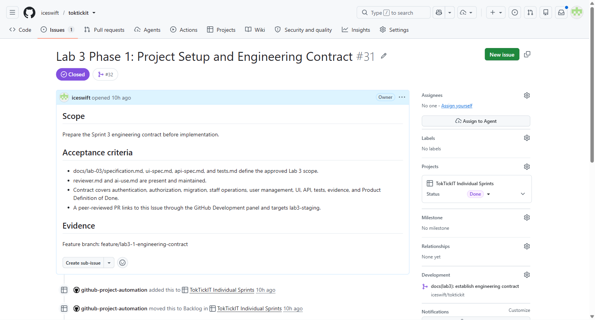

# TokTickIT Lab 3 Report Source

This is the maintained source for the final single-PDF submission. It records only evidence that is already available; sections for later phases remain intentionally incomplete until their evidence exists.

## Part 1 — Workflow, Repository, and Evidence

### Phase 1 workflow evidence

- Issue: [#31 — Lab 3 Phase 1: Project Setup and Engineering Contract](https://github.com/iceswift/toktickit/issues/31).
- Feature branch: `feature/lab3-1-engineering-contract`.
- Peer-reviewed staging PR: [#32 — docs(lab3): establish engineering contract](https://github.com/iceswift/toktickit/pull/32), targeting `lab3-staging`.
- Reviewer: `Richyboy170`; approval and merge were performed by that reviewer. The merge commit is `42079a7`.
- The Issue is closed as `completed`. GitHub Project automation moved its card from `Started` to `Done`.
- The Issue Development panel lists the merged PR #32. This is a direct Issue–PR linkage, not merely a keyword in a PR description.

## Part 2 — Specification and Definition of Done

The Phase 1 engineering contract is maintained in the following reviewed documents:

- [Product specification](specification.md)
- [UI specification](ui-spec.md)
- [API specification](api-spec.md)
- [Test design and Definition of Done](tests.md)

## Part 3 — Test Evidence

Pending Phase 2–8 implementation and final execution from `main`.

## Part 4 — AI Use and Reflection

The running AI-use record and reflection are maintained in [ai-use.md](ai-use.md). It contains eight prompt focuses and states the student verification expected for each.

## Part 5 — Login Evidence

Pending Phase 3 implementation and verification.

## Part 6 — IT Staff Queue Evidence

Pending Phase 5 implementation and verification.

## Part 7 — IT Staff Detail and Authorization Evidence

Pending Phase 6 implementation and verification.

## Part 8 — Administrator User Management Evidence

Pending Phase 7 implementation and verification.

## Part 9 — Zen Green UI and Responsive Evidence

Pending the responsive UI work and its desktop/tablet/mobile captures.
